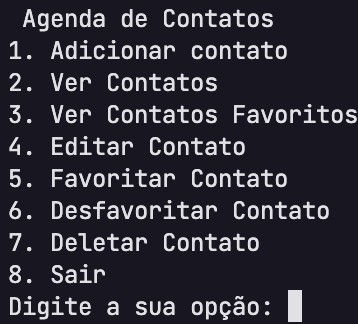
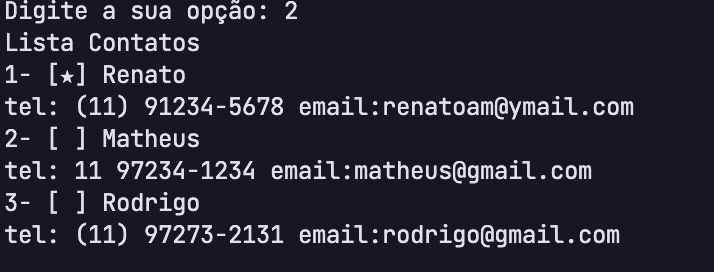

# Challenge01 - Agenda de Contatos
Desafio da RocketSeat - Desenvolver uma agenda de contatos usando os conceitos do módulo 1

Esta agenda de contatos foi desenvolvida para uso no terminal.
Ela possui as funciondalides: 
1. Adição de Contato
2. Ver Contato
3. Editar Contato
4. Favoritar Contato
5. Deletar Contato
6. Sair 

## Imagem da aplicação rodando no terminal: 
### Menu da aplicação:


### Funcionalidade Ver Contatos:


## Requisitos para executar a aplicação
Necessário ter o python instalado na versão 3.12.1 ou superior
https://www.python.org/ 

## Para executar a aplicação
após clonar o repositório na sua máquina, na raiz da aplicação executar o código abaixo.

```
python contatos.py
```
ou
```
python3 contatos.py
```

## Regras da aplicação

- A aplicação deve iniciar mostrando uma lista de opções do que é possível fazer com o app e permitir que o usuário digite uma escolha para iniciar a aplicação.
- Deve ser possível adicionar um contato
    - O contato pode ter os dados:
    - Nome
    - Telefone
    - Email
    - Favorito (está opção é para poder marcar um contato como favorito)
- Deve ser possível visualizar a lista de contatos cadastrados
- Deve ser possível editar um contato
- Deve ser possível marcar/desmarcar um contato como favorito
- Deve ser possível ver uma lista de contatos favoritos
- Deve ser possível apagar um contato